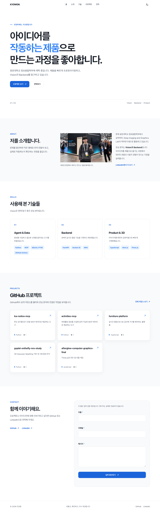

# B1-1 자기소개 웹페이지

## 수행 내용

순수 HTML·CSS·JavaScript로 자기소개 웹페이지를 구현함.
파랑색을 중심으로 모바일 우선 반응형 화면을 구성함.

## 구현 기능

시맨틱 HTML, Flexbox, Grid로 화면을 구성하고 다크 모드·모바일 메뉴·스크롤 효과를 구현함.
GitHub 저장소 비동기 조회와 로딩·오류·재시도 상태, 연락 폼의 입력 검증을 구현함.

## 화면 설정

| 항목 | 적용값 |
|---|---|
| 포인트 색상 | `#3182f6` |
| 헤더 배경 변경 | 스크롤 60px 이상임 |
| 맨 위로 버튼 | 스크롤 300px 이상에서 표시함 |
| 섹션 등장 임계값 | `IntersectionObserver`의 `threshold=0.2`임 |
| 움직임 줄이기 | 사용자 설정에 따라 등장 효과와 부드러운 스크롤을 해제함 |

## 검증 결과

공개 배포 화면에서 반응형 레이아웃, GitHub 조회, 다크 모드와 입력 검증을 확인함.
[데스크톱](screenshots/desktop.png)·[모바일](screenshots/mobile.png)·[다크 모드](screenshots/dark.png) 화면을 증빙으로 남김.

## 배포와 한계

[GitHub Pages](https://kyowon1108.github.io/2026_Codyssey_AISW_Basic/)에 배포함.
연락 폼은 입력 검증용이며 메시지는 전송하지 않음.

