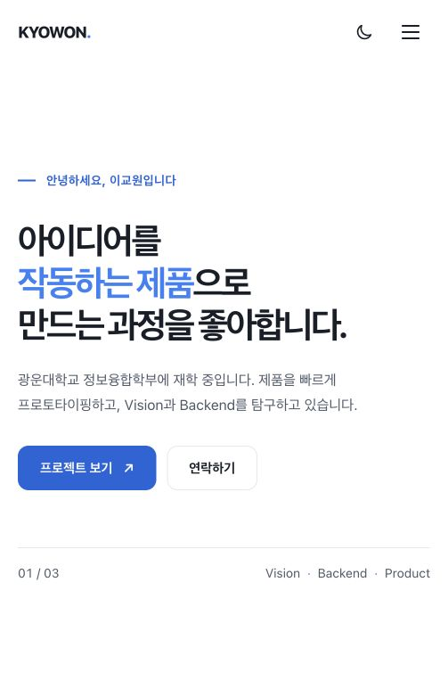

# B3-1 — AWS 웹 배포

2026-10-02 서울 리전에서 B1-1 웹페이지를 EC2에 배포·검증한 뒤 실습 리소스를 삭제했다. **아래 IP는 당시 접속 주소이며 현재는 접속되지 않는다.**

| 요구 | 실행·확인 결과 |
|---|---|
| 네트워크 | 전용 VPC `10.31.0.0/16`, 퍼블릭 서브넷 `10.31.1.0/24`, IGW, `0.0.0.0/0 → IGW` 라우트 활성 확인 |
| 서버 | Amazon Linux 2023 `t3.micro` 1대, Nginx `active`, SSH 접속 성공, 내부 `/`·`/health` 모두 200, 외부 HTTPS 요청 200 |
| 접근 제어 | SG: HTTP 80=`0.0.0.0/0`, SSH 22=당시 개인 IP `/32`. 전용 IAM 역할에 서울 리전 EC2/VPC 작업만 허용, 연결된 관리자 정책 없음 |
| **외부 접속 방식 A** | 브라우저 `http://54.180.255.77/`에서 페이지 표시. 외부 `GET /health`도 **200 OK / OK** |
| 정리 | EC2 `i-0d519f1c43568916c` 종료; EBS·VPC·서브넷·IGW·라우트·SG·키페어·IAM 역할 제거. 실습 EIP는 생성하지 않음 |

IAM 정책은 EC2 작업과 서울 리전으로 제한했으며, 리소스 태그 단위 제한은 적용하지 않았다.

### 증빙

[구조도](docs/architecture.png), [문제 해결](docs/troubleshooting.md), [정리 확인](docs/cleanup-checklist.md), [적용한 IAM 정책](docs/iam-policy.json), [서버 설치 내용](deploy-user-data.sh)
