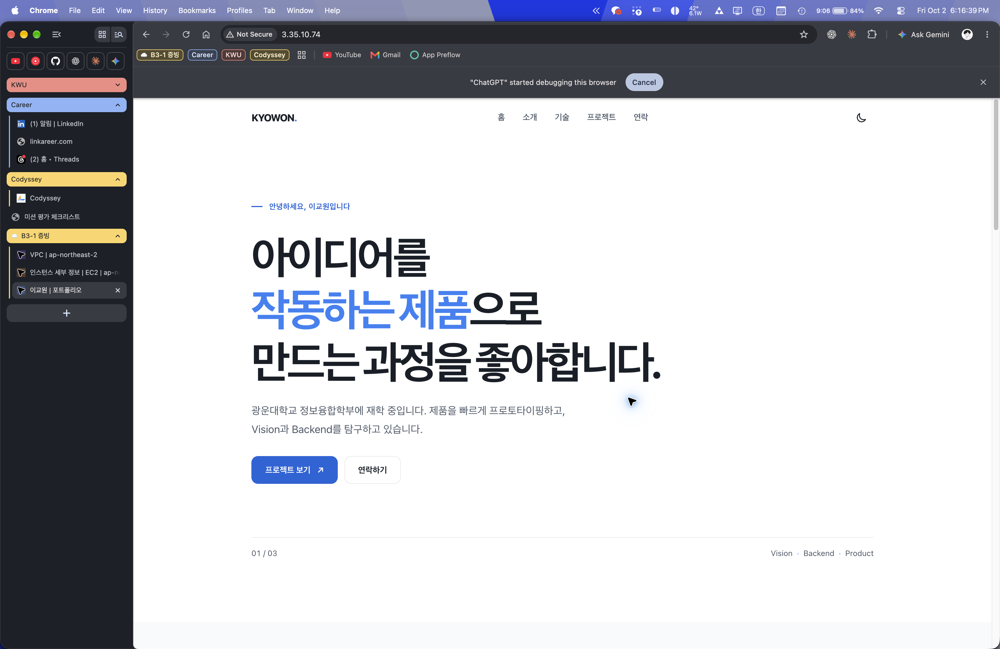

# B3-1 — AWS 웹 배포 재검증

2026-10-02 서울 리전의 별도 VPC와 EC2에 [B1-1](../B1-1/)을 배포했다. 외부 접속과 SSH를 확인한 뒤 실습 리소스를 모두 정리했다. 당시 퍼블릭 IP `3.35.10.74`는 **현재 접속되지 않는다**.

| 단계 | 실제 결과와 증빙 |
|---|---|
| 네트워크 | VPC `10.31.0.0/16` [생성 화면](docs/evidence/01-vpc.jpg), 퍼블릭 서브넷 `10.31.1.0/24`과 활성 `0.0.0.0/0 → IGW` [라우트 화면](docs/evidence/02-route.jpg) |
| 접근 제어 | HTTP 80은 전체 공개, SSH 22는 당시 개인 IP `/32`만 허용한 [SG 화면](docs/evidence/03-security-group.jpg). 전용 [IAM 역할 사용 기록](docs/evidence/00-iam-role.txt)과 [정책](docs/iam-policy.json) |
| 서버·SSH | Amazon Linux 2023 `t3.micro` [실행 화면](docs/evidence/04-ec2.jpg). [원본 SSH 기록](docs/evidence/05-ssh-session.txt)에 `Accepted publickey`, Nginx `active`, 내부 HTTP 200, 아웃바운드 HTTPS 200 포함 |
| 외부 접속 **방식 A** | Chrome에서 `http://3.35.10.74/`로 페이지 표시. 추가로 [외부 `/health` 원본 응답](docs/evidence/07-external-health.txt)이 `200 OK`와 `OK`를 반환 |
| 정리 | [EC2 종료 화면](docs/evidence/08-ec2-terminated.jpg), [유형별 삭제 조회](docs/evidence/09-cleanup-cli.txt), [VPC 삭제 화면](docs/evidence/10-vpc-cleaned.jpg) |

[아키텍처](docs/architecture.png) · [트러블슈팅](docs/troubleshooting.md) · [정리 체크리스트](docs/cleanup-checklist.md) · [서버 설치 스크립트](deploy-user-data.sh)
