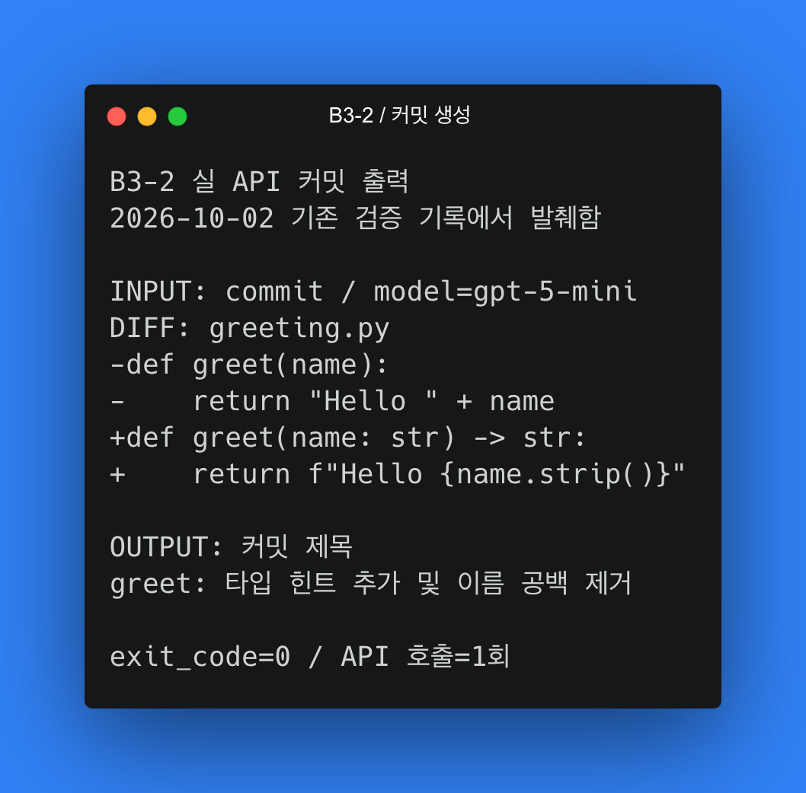
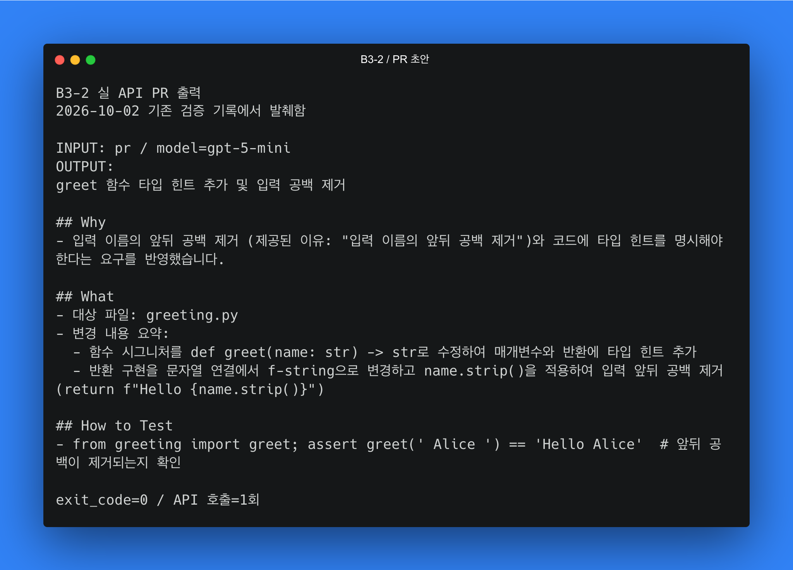
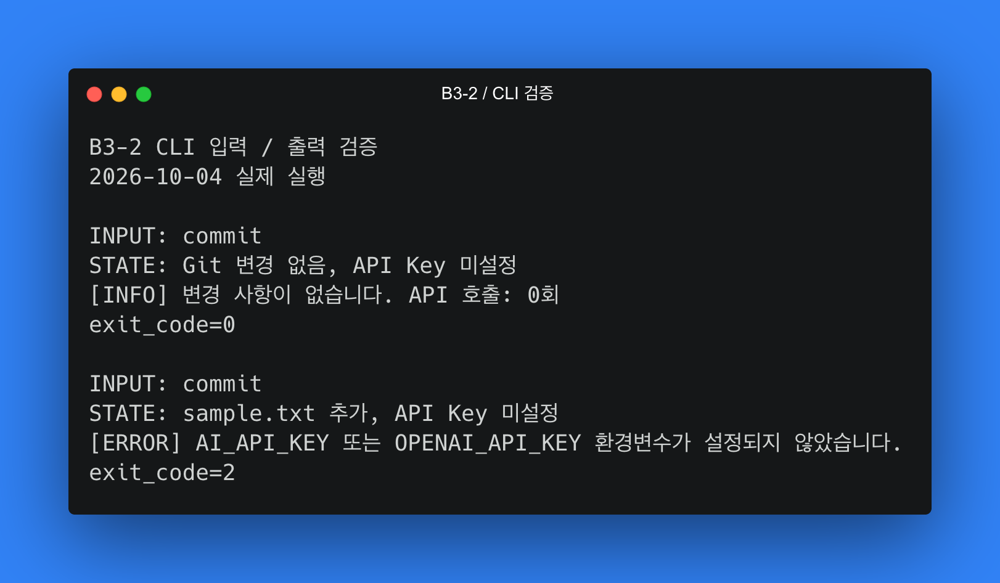

# B3-2 AI 커밋 메시지·PR 초안 생성기

## 수행 내용

Git 변경 사항을 수집해 REST AI API로 변경 요약과 커밋·PR 초안을 생성하는 Python CLI를 구현함.
실제 코디세이 API 호출과 로컬 통합 검증을 수행함.

## 구현과 검증

변경 수집, 민감정보 마스킹, 응답 형식 검증과 오류 처리를 구현함.
[검증 보고서](docs/verification.md)에 테스트 41개 통과, 정적 검사와 실제 API 표본 검토 결과를 기록함.

## 실행 환경

| 항목 | 적용값 |
|---|---|
| 환경 | Python 3.10 이상, Git, uv임 |
| API 키 | `AI_API_KEY` 또는 `OPENAI_API_KEY`이며 전자를 우선함 |
| 로컬 키 파일 | `.env`는 Git에서 제외하며 환경변수로 불러와 사용함 |
| 기본 API | `https://copa.codyssey.kr/v1`임 |
| 기본 모델 | `gpt-5-mini`임 |
| 토큰 상한 | 기본 4000이며 `--max-tokens`로 지정함 |
| temperature | 기본 생략이며 지원 모델에서만 `--temperature`로 지정함 |

## 과제 필수 사용 예시

과제에서 요구한 설치·키 설정·생성 명령 예시임.
설치는 이 저장소 루트에서 수행하고 생성 명령은 변경을 설명할 Git 저장소 루트에서 수행하는 구조임.

```bash
uv sync --project B3-2
export AI_API_KEY="발급받은_API_키"
# 저장한 로컬 키를 사용할 경우: set -a; source B3-2/.env; set +a
B3-2/.venv/bin/python B3-2/main.py commit
B3-2/.venv/bin/python B3-2/main.py pr --reason "이름 입력 공백 제거"
```

## 실제 커밋 출력

임시 저장소의 `greeting.py` 변경으로 실제 API를 호출했으며 제목과 핵심 변경이 일치함을 확인함.
다음은 기존 실 API 원문을 Carbon 이미지로 옮긴 발췌이며 [텍스트 원문](docs/evidence/live-20261002-excerpts.txt)을 함께 보존함.



## 실제 PR 출력

PR의 Why·What·How to Test 형식을 확인함.
아래는 2026-10-02 결과의 핵심 발췌이며 테스트 제안은 실행 성공 증빙과 구분함.



## CLI 입력 검증

2026-10-04 임시 Git 프로젝트에서 변경 없음은 종료 코드 0·API 호출 0회, 변경이 있으나 키가 없으면 종료 코드 2임을 확인함.
[실행 원본](docs/evidence/cli-boundaries.txt)과 [테스트 41개 통과 로그](docs/evidence/tests.txt)를 보존함.



## 옵션별 실 API 비교

2026-10-04 같은 변경·모델에서 `--max-tokens` 2000과 4000으로 커밋·PR을 생성했으며 각각 정상 종료·API 1회·Git 상태 불변을 확인함.
PR 본문은 525자와 798자로 관측했으나 토큰 상한이 항상 더 긴 출력을 보장하는 것은 아님.

| 토큰 상한 | 실 실행 원본 |
|---|---|
| 2000 | [커밋·PR 결과](docs/evidence/live-20261004-2000.txt) |
| 4000 | [커밋·PR 결과](docs/evidence/live-20261004-4000.txt) |

## 제출 PR과 생성 결과

[제출 PR #1](https://github.com/kyowon1108/2026_Codyssey_AISW_Basic/pull/1)의 본문은 Why·What·How to Test를 포함하며 본문과 위 도구의 실제 생성 결과를 구분함.

## 안전 모드와 한계

기본 안전 모드에서 민감 파일 제외와 키·개인정보 마스킹을 적용함.
도구는 초안만 출력하며 결과의 정확성은 사용자가 검토해야 하는 구조임.

| 항목 | 제한 |
|---|---|
| 전송 범위 | 최대 10개 파일·diff 200줄·20,000자임 |
| 생성 요청 | 정상 1회, 형식 보정 포함 최대 2회임 |
| 키 관리 | 환경변수에서만 읽으며 소스·로그에 기록하지 않음 |
| raw 모드 | 제외·마스킹을 해제하며 전송량 제한은 유지함 |

정규식 마스킹으로 모든 비밀정보를 탐지할 수는 없음.
Git 내용과 파일명이 외부 API로 전송되므로 민감한 저장소에서는 전송 범위 확인이 필요함.
