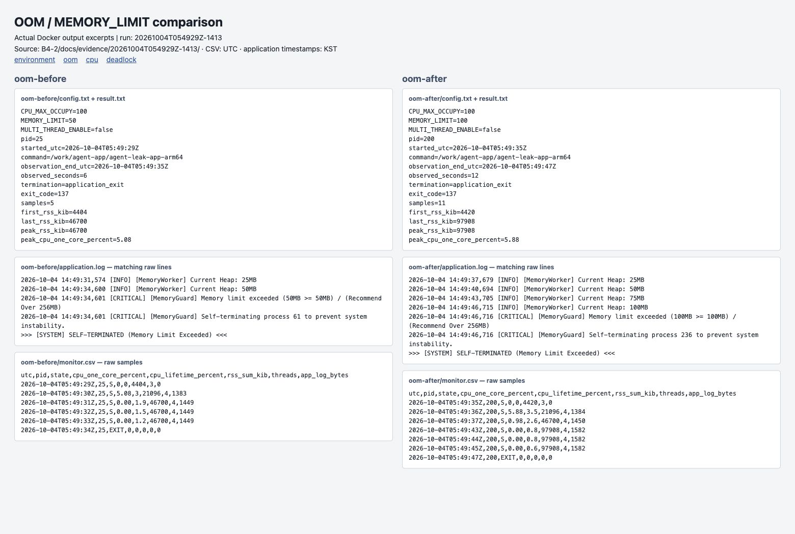

# [Bug] OOM — 메모리 증가로 MemoryGuard가 프로세스 종료

## 1. Description (현상 설명)
2026-10-04 Ubuntu 22.04 ARM64 컨테이너에서 제공 앱을 일반 사용자로 실행했다. `MEMORY_LIMIT=50`, `CPU_MAX_OCCUPY=100`, `MULTI_THREAD_ENABLE=false`에서 약 6초 후 종료됐다.

## 2. Evidence & Logs (증거 자료)

- [설정·종료 결과](../evidence/20261004T054929Z-1413/oom-before/result.txt), [monitor.sh 원본 CSV](../evidence/20261004T054929Z-1413/oom-before/monitor.csv), [ps/스레드 출력](../evidence/20261004T054929Z-1413/oom-before/process.txt).
- [실행 로그](../evidence/20261004T054929Z-1413/oom-before/application.log): `Current Heap: 25MB` → `50MB` → `Memory limit exceeded (50MB >= 50MB)` → `SELF-TERMINATED (Memory Limit Exceeded)`.
- 런처 포함 RSS 증가와 종료 시간은 아래 비교 표 참조. 커널 OOM은 [cgroup 전](../evidence/20261004T054929Z-1413/oom-before/cgroup-before.txt)/[후](../evidence/20261004T054929Z-1413/oom-before/cgroup-after.txt)로 별도 확인한다.

## 3. Root Cause Analysis (원인 분석)
Heap 로그와 RSS가 함께 증가해 메모리 누적을 뒷받침한다. MemoryGuard가 자체 한도에 도달해 강제 종료했고 종료 코드는 137(SIGKILL에 대응)이다. 커널 OOM Killer에 의한 종료와 구분한다. 실행 관측만으로 어떤 객체가 해제되지 않았는지 확정할 수 없으므로, 누수의 소스 코드 위치는 미확인이다.

## 4. Workaround & Verification (조치 및 검증)
`MEMORY_LIMIT`만 50 → 100MB로 변경하여 재실행했다. [변경 후 로그](../evidence/20261004T054929Z-1413/oom-after/application.log)에서도 100MB 도달 후 동일한 보호 종료가 발생했다.

| 항목 | Before | After |
|---|---:|---:|
| 한도 | 50MB | 100MB |
| 생존 시간 | 6초 | 12초 |
| 최대 RSS 합계 | 46,700KiB | 97,908KiB |
| 종료 코드 | 137 | 137 |

한도 상향은 생존 시간을 늘리는 임시 조치다. 근본 해결에는 보유 객체와 해제 경로를 소스에서 점검해야 한다. 관찰 간격은 1초로 종료 시간에는 약 1초의 측정 오차가 있다.
