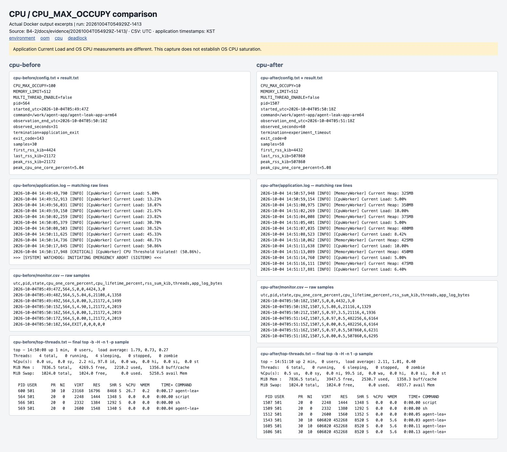

# [Bug] CPU — 앱 내부 부하 임계치 초과로 Watchdog 종료

## 1. Description (현상 설명)
2026-10-04 동일 Linux 환경에서 `MEMORY_LIMIT=512`, `CPU_MAX_OCCUPY=100`, `MULTI_THREAD_ENABLE=false`로 실행하면 앱 내부 부하가 증가하고 약 31초 후 SIGTERM으로 종료됐다.

## 2. Evidence & Logs (증거 자료)

- [실행 로그](../evidence/20261004T054929Z-1413/cpu-before/application.log): `Current Load: 5.00%` → `50.86%` → `CPU Threshold Violated! (50.86%)` → `WATCHDOG: INITIATING EMERGENCY ABORT (SIGTERM)`.
- [monitor.sh CSV](../evidence/20261004T054929Z-1413/cpu-before/monitor.csv), [ps](../evidence/20261004T054929Z-1413/cpu-before/process.txt), [top -H](../evidence/20261004T054929Z-1413/cpu-before/top-threads.txt), [종료 결과](../evidence/20261004T054929Z-1413/cpu-before/result.txt): 종료 코드 143.

## 3. Root Cause Analysis (원인 분석)
관측한 종료 원인은 앱 내부 부하 임계치 위반에 따른 Watchdog 보호 정책이다. **앱의 50.86%와 OS CPU 측정값은 다르다.** Linux 관제의 한 코어 기준 최대값은 5.04%였으며 높은 CPU 과점유나 실제 응답 지연은 확인하지 못했다. `top` 첫 샘플에는 앱 PID 600의 26.7%가 잡혔지만 구간 관제값과 측정 기준이 다르며 임계치 초과를 입증하지 못했다. 부하 수치가 어떻게 계산되는지는 바이너리 내부를 분석하지 않아 미확인이다.

일반적으로 CPU를 독점하는 작업은 실행 대기와 응답 지연을 늘릴 수 있지만, 이 실행에서 그런 시스템 장애가 입증됐다고 주장할 수 없다. 따라서 과제의 'OS 도구로 CPU 급상승 확인' 항목에는 증거 한계가 남는다.

## 4. Workaround & Verification (조치 및 검증)
다른 변수는 유지하고 `CPU_MAX_OCCUPY`를 100 → 10%로 낮췄다. [변경 후 로그](../evidence/20261004T054929Z-1413/cpu-after/application.log)와 [결과](../evidence/20261004T054929Z-1413/cpu-after/result.txt)를 비교한다. 관찰 종료를 위한 SIGTERM은 별도 `harness.log`에 기록하고 Watchdog 종료와 구분한다.

10% 제한은 CPU 장애 회피 검증이며 메모리 누적까지 해결하는 조치가 아니다. 장시간 운영 여부는 별도 검증해야 한다.

| 항목 | Before | After |
|---|---:|---:|
| CPU_MAX_OCCUPY | 100% | 10% |
| 관찰 결과 | 31초, Watchdog 종료 | 60초간 Watchdog 없음, 관찰 종료 |
| OS 구간 관제 최대 CPU | 5.04% | 5.08% |
