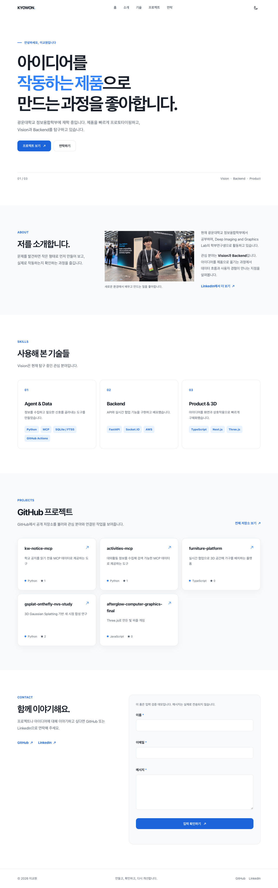
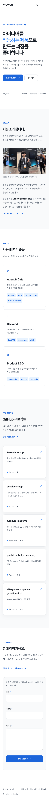
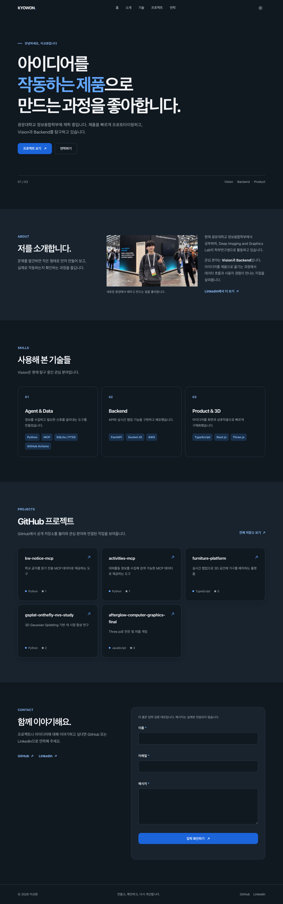

# 이교원 포트폴리오

B1-1 과제로 만든 반응형 자기소개 웹페이지입니다. 토스 디자인 시스템의 파랑(`#3182f6`)을 포인트로 사용하고, 순수 HTML·CSS·JavaScript만으로 구현했습니다.

## 실행

VS Code에서 이 배포 브랜치의 루트 폴더를 열고 Live Server 확장(`ritwickdey.LiveServer`)을 설치한 뒤 `index.html`을 **Open with Live Server**로 실행합니다. 또는 루트에서 아래 명령을 실행합니다.

```bash
python3 -m http.server 8000
```

브라우저에서 `http://localhost:8000`으로 접속합니다.

## 사용 기술과 기능

- 시맨틱 HTML, Flexbox, CSS Grid, 모바일 우선 반응형 CSS
- 다크 모드와 `localStorage` 저장, 모바일 메뉴, 부드러운 스크롤, 맨 위로 버튼
- `IntersectionObserver`를 이용한 섹션 등장 효과
- `fetch`와 `async/await`를 이용한 GitHub 공개 저장소 조회
- 프로젝트 로딩·성공·오류·빈 목록 상태와 오류 시 재시도
- 이름·이메일·메시지 입력 검증. 이 폼은 검증 데모이며 **메시지를 전송하지 않습니다.**

GitHub API는 인증하지 않은 요청에 시간당 호출 제한이 있습니다. 제한에 걸리거나 네트워크가 끊기면 오류 상태와 재시도 버튼을 표시합니다.

## 상태와 화면 업데이트

| 사용자 또는 시스템 이벤트 | 상태 변경 | 화면 변화 |
| --- | --- | --- |
| 테마 버튼 클릭 | `state.theme` 변경 및 저장 | CSS 색상과 버튼 설명 변경 |
| GitHub API 요청 | `loading` → `success` / `empty` / `error` | 프로젝트 카드 또는 상태 안내 표시 |
| 폼 입력·제출 | 필드 검증 결과 변경 | 필드 근처 오류 또는 입력 확인 메시지 표시 |

스크롤 60px부터 헤더 배경을 바꾸고, 300px부터 맨 위로 버튼을 표시합니다. 섹션 등장 효과의 `IntersectionObserver` 임계값은 `0.2`입니다. 움직임 줄이기 설정이 켜지면 등장 효과와 부드러운 스크롤을 해제합니다.

## 배포

GitHub Pages 배포 URL: https://kyowon1108.github.io/2026_Codyssey_AISW_Basic/

배포 소스는 `codex/b1-1-pages` 브랜치의 루트(`/`)입니다.

## 화면






